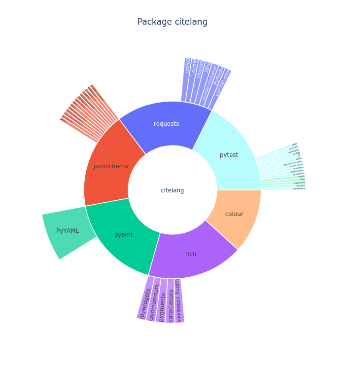

# CiteLang

Welcome to CiteLang! This is the first markdown syntax for citing software. Importantly,
when you use CiteLang to reference software.

1. Generate basic software credit trees (citelang graph, badge, or credit)
2. Give credit accounting for dependencies! (see [software-credit.md](software-credit.md))
3. Actions (automation) for the above!

No - we aren't using DOIs! A manually crafted identifier that a human has to remember to generate,
in addition to a publication or release, is too much work for people to reasonably do. As research
software engineers we also want to move away from the traditional "be valued like an academic" model.
We are getting software metadata and a reference to an identifier via a package manager. This means
that when you publish your software, you should publish it to an appropriate package manager.

⭐️ [Documentation](https://vsoch.github.io/citelang) ⭐️ 

## TODO

 - citelang should be able to parse requirements.txt or go.sum, etc.
 - colors should be meaningful

## Contributors

We use the [all-contributors](https://github.com/all-contributors/all-contributors) 
tool to generate a contributors graphic below.

<!-- ALL-CONTRIBUTORS-LIST:START - Do not remove or modify this section -->
<!-- prettier-ignore-start -->
<!-- markdownlint-disable -->
<table>
  <tr>
    <td align="center"><a href="https://vsoch.github.io"> <b>Vanessasaurus</b></a> <a href="https://github.com/vsoch/citelang/commits?author=vsoch" title="Code">💻</a></td>
  </tr>
</table>

<!-- markdownlint-restore -->
<!-- prettier-ignore-end -->

<!-- ALL-CONTRIBUTORS-LIST:END -->

## License

This code is licensed under the MPL 2.0 [LICENSE](LICENSE).
