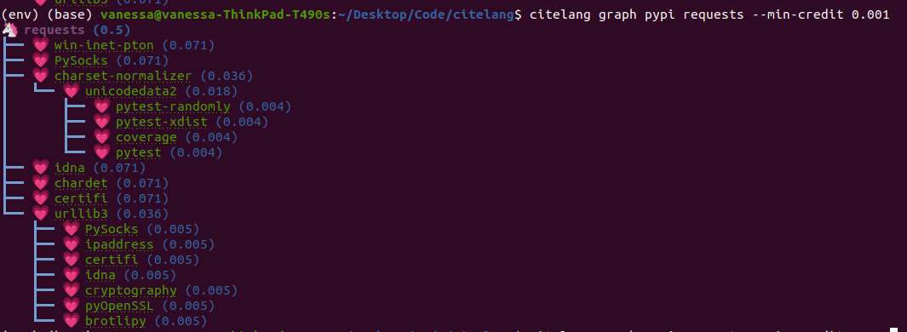
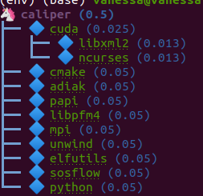
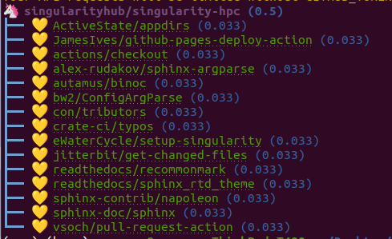
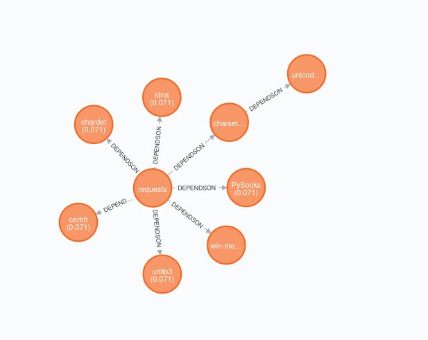

# CiteLang

[](https://badge.fury.io/py/citelang)

Welcome to CiteLang! This is the first markdown syntax for citing software. Importantly,
when you use CiteLang to reference software.

1. Generate basic software credit trees
2. Give credit accounting for dependencies!

No - we aren't using DOIs! A manually crafted identifier that a human has to remember to generate,
in addition to a publication or release, is too much work for people to reasonably do. As research
software engineers we also want to move away from the traditional "be valued like an academic" model.
We are getting software metadata and a reference to an identifier via a package manager. This means
that when you publish your software, you should publish it to an appropriate package manager.

## Quick Start

CiteLang will require a libraries.io token, so you should [login](https://libraries.io/) (it works with 
GitHub and other easy OAuth2 that don't require permissions beyond your email) and then
go to the top right -> Settings -> API Key.

You'll want to export this in the environment:

```bash
export CITELANG_LIBRARIES_KEY=xxxxxxxxxxxxxxxxxxxxxxxxx
```

And of course you will need to install it, either from pip or the repository.

```bash
$ pip install citelang
```
or

```bash
$ git clone https://github.com/vsoch/citelang
$ cd citelang
$ pip install -e .
```

This will place an executable `citelang` in your directory. For the commands below,
we will show interactions using the command line client and Python API.

## Usage

The following commands are available.

### Package Managers

Let's find package managers supported.

```bash
$ citelang list
```

This gives us the listing of package managers that we can interact with. Since by default
we create a cache of results (to not use our token ratelimit whenever possible) after calling
this endpoint you'll find packages cached in your citelang home!

```bash
$ tree ~/.citelang/
/home/vanessa/.citelang/
├── cache
│   └── package_managers.json
└── settings.yml
```

This means if you make the call again, it will load data from here instead of making an API call.
Note that there are actually two caches - the filesystem and memory cache. These are discussed in the
config section. You can disable using or setting the cache for any command as follows:

```bash
$ citeling list --no-cache
```

### Package

To get metadata for a package, or from the command line, to list versions available:

```bash
$ citelang package pypi requests
```

### Dependencies

You can ask to see package dependencies:


```bash
$ citelang deps pypi requests
```

If you don't provide a version, the latest will be used (retrieved from the package).

```bash
$ citelang deps pypi requests@2.27.1
```


### Config

You don't technically need to do any custom configuration. However, if you want to make
your own user-specific settings file:

```bash
$ citelang config inituser
```

You can also edit the default config in [citelang/settings.yml](citelang/settings.yml)
if you control the install. We will be adding a table of settings when we add official
documentation. For now, let's talk about specific variables.

#### disable_cache

This defaults to false, meaning we aren't disabling the cache. Not disabling the cache
means we can cache different results in your citelang home. We do this to minimize API calls.
The exception is for when you ask for a package without a version. Since we cannot
be sure what the latest version is, we need to check again.

#### disable_memory_cache

Akin to the filesystem, given that you are using a client in a session (whether directly
in Python or via a command provided by citelang) we will cache results in memory. E.g.,
if you are asking for multiple packages, we check first that you are asking for a valid
manager. When we cache the list of managers available, this is possible without an extra
API call.


## Cache

Citelng includes a cache command group for viewing or clearing your filesystem cache.

```bash
$ citelang cache
/home/vanessa/.citelang/cache
```

Or list what's in it!

```bash
$ tree $(citelang cache)
```

And finally, clear it. You'll get a confirmation prompt first.

```bash
$ citelang cache --clear
Are you sure you want to clear the cache? yes
```

### Credit

To create a simple citation credit calculation, you can do:

```bash
$ citelang credit pypi requests
```

By default, we will split the credit graph until:

 1. if set, we reach a threshold N of packages added (`--max-depth`)
 2. if set, we reach a total number of unique dependencies added (`--max-deps`)
 3. we reach a threshold that is smaller than our minimum credit (`--min-credit`) 

It's up to you to set the first two cases (they default to None, meaning unset) and
we always only go up to a minimum threshold (or when there are no more dependencies to allocate).
Note that first time you do it, you'll see the endpoints being hit (they aren't cached yet):

```bash
$ citelang credit pypi requests
GET https://libraries.io/api/platforms
GET https://libraries.io/api/pypi/requests
GET https://libraries.io/api/pypi/requests/2.27.1/dependencies
GET https://libraries.io/api/pypi/win-inet-pton
GET https://libraries.io/api/pypi/win-inet-pton/1.1.0/dependencies
GET https://libraries.io/api/pypi/PySocks
GET https://libraries.io/api/pypi/PySocks/1.7.1/dependencies
GET https://libraries.io/api/pypi/charset-normalizer
GET https://libraries.io/api/pypi/charset-normalizer/2.0.12/dependencies
GET https://libraries.io/api/pypi/idna
GET https://libraries.io/api/pypi/idna/0.1/dependencies
GET https://libraries.io/api/pypi/chardet
GET https://libraries.io/api/pypi/chardet/4.0.0/dependencies
GET https://libraries.io/api/pypi/certifi
GET https://libraries.io/api/pypi/certifi/2015.4.28/dependencies
GET https://libraries.io/api/pypi/urllib3
GET https://libraries.io/api/pypi/urllib3/1.26.8/dependencies
```
And then you'll get the credit score:

```bash
$ citelang credit pypi requests 
              requests: 0.5
           win-inet-pton: 0.071
                 PySocks: 0.071
      charset-normalizer: 0.036
                unicodedata2: 0.036
                    idna: 0.071
                 chardet: 0.071
                 certifi: 0.071
                 urllib3: 0.071
total: 1.0
```

The default "minimum credit" (to determine when we stop parsing) is 0.01. 
You can also try changing this value!

```bash
$ citelang credit pypi requests --min-credit 0.005
              requests: 0.5
           win-inet-pton: 0.071
                 PySocks: 0.071
      charset-normalizer: 0.036
                unicodedata2: 0.036
                    idna: 0.071
                 chardet: 0.071
                 certifi: 0.071
                 urllib3: 0.036
                     PySocks: 0.005
                   ipaddress: 0.005
                     certifi: 0.005
                        idna: 0.005
                cryptography: 0.005
                   pyOpenSSL: 0.005
                    brotlipy: 0.005
total: 1.0
```

By default, the `--max-depth` and `--map-deps` are unset so we don't stop parsing based on some
maximum depth or number of dependencies. You can try setting these values as well.


### Graph

To create a simple citation graph, you can do:

```bash
$ citelang graph pypi requests
```

This will print a (much prettier) rendering of the graph to the console! Here is for pypi:



And citelang has custom package parsers, meaning we can add package managers that aren't in libraries.io!
Here is spack:

```bash
$ citelang graph spack caliper
```



And GitHub.

```bash
$ citelang graph github singularityhub/singularity-hpc
```


GitHub is a bit of a deviant parser because we use the dendency graph that GitHub has found in your repository.
If you have a non-traditional way of defining deps (e.g., singularity-cli above writes them into a version.py that gets piped into setup.py) they won't show up. Also note that when you cite GitHub, we are giving credit to ALL the software you use for your setup, including documentation and CI. Here is a more traditional GitHub repository
that has a detectable file.


#### Dot

To generate (and then render a dot graph):

```bash
$ citelang graph pypi requests --fmt dot > examples/dot/graph.dot
$ dot -Tpng < examples/dot/graph.dot > examples/dot/graph.png
$ dot -Tsvg < examples/dot/graph.dot > examples/dot/graph.svg
```

#### Cypher

Cypher is the query format for Neo4j, the graph database.

```bash
$ citelang graph pypi requests --fmt cypher
```
```cypher
CREATE (tlolycos:PACKAGE {name: 'requests (0.5)', label: 'tlolycos'}),
(jgaoitav:PACKAGE {name: 'win-inet-pton (0.071)', label: 'jgaoitav'}),
(jijibmow:PACKAGE {name: 'PySocks (0.071)', label: 'jijibmow'}),
(gotbtadg:PACKAGE {name: 'charset-normalizer (0.036)', label: 'gotbtadg'}),
(lflybqsc:PACKAGE {name: 'idna (0.071)', label: 'lflybqsc'}),
(kitlrsbz:PACKAGE {name: 'chardet (0.071)', label: 'kitlrsbz'}),
(gnveurko:PACKAGE {name: 'certifi (0.071)', label: 'gnveurko'}),
(eoikqvix:PACKAGE {name: 'urllib3 (0.071)', label: 'eoikqvix'}),
(kvccvkva:PACKAGE {name: 'unicodedata2 (0.036)', label: 'kvccvkva'}),
(tlolycos)-[:DEPENDSON]->(jgaoitav),
(tlolycos)-[:DEPENDSON]->(jijibmow),
(tlolycos)-[:DEPENDSON]->(gotbtadg),
(tlolycos)-[:DEPENDSON]->(lflybqsc),
(tlolycos)-[:DEPENDSON]->(kitlrsbz),
(tlolycos)-[:DEPENDSON]->(gnveurko),
(tlolycos)-[:DEPENDSON]->(eoikqvix),
(gotbtadg)-[:DEPENDSON]->(kvccvkva);
```

What you are seeing above is a definition of node and relationships. You can pipe to file:


```bash
$ citelang graph pypi requests --fmt cypher > examples/cypher/graph.cypher
```

If you test the output in the [Neo4J sandbox](https://sandbox.neo4j.com/) by first running the code to generate nodes and then doing:

```bash
MATCH (n) RETURN (n)
```

You should see:




From within Python you can do:

```python
from citelang.main import Client
client = Client()
client.graph(manager="pypi", name="requests", fmt="cypher")
```

#### Gexf (NetworkX)

If you want to use networkX or Gephi or a [viewer](https://github.com/raphv/gexf-js) you can generate output as follows:

```bash
$ citelang graph pypi requests --fmt gexf
$ citelang graph pypi requests --fmt gexf > examples/gexf/graph.xml
```

To use the viewer, you’ll first need to import into Gephi so the nodes have added spatial information. Without this information, you won’t see them in the UI. You can then do the following:

```bash
$ here=$PWD
$ cd /tmp
$ git clone https://github.com/raphv/gexf-js
$ cd gexf-js
```

The file we generated above, we copy over the example so we don't have to edit config.js

```bash
$ cp $here/examples/gexf/graph.xml miserables.gexf
```

And then run the server!

```bash
python -m http.server 9999
```

As an alternative, networkx can also read in the gexf file:

```python
import matplotlib.pyplot as plt
import networkx as nx

graph = nx.read_gexf('examples/gexf/graph.xml')

nx.draw(graph, with_labels=True, font_weight='bold')
plt.show()
```

That should generate:


### Render

This will be a set of commands that can take any of:

1. an entire markdown file with software references 
2. a grouping / list of software references

and create a citation summary, probably in different formats that are useful. This isn't developed yet
but this dinosaur is excited so it's coming soon!

**under development** more coming soon!


### Python

You can do all of the same interactions from within Python! And indeed if you want
to do some kind of analysis or custom parsing this is the recommended approach.
For all cases from within Python, after exporing the token, we need to create a client.

```python
from citelang.main import Client
client = Client()
```

You can optionally provide a custom settings file:


```python
client = Client(settings_file="settings.yml")
```

Now let's get our list of package managers:

```python
$ result = client.package_managers()
```

The raw data will be here on the results object:

```python
$ result.data
```

And this is how we print to the terminal

```python
$ result.table()
```

Let's say you ran this, and you wanted to retrieve it again! Given that `disable_cache` in your settings
is not set to True, you can call the function again and the data returned will be from the cache.
You can also ask for it verbatim:

```python
$ client.package_managers()
```
or 

```python
$ client.get_cache('package_managers')
...
 {'name': 'Inqlude',
  'project_count': 228,
  'homepage': 'https://inqlude.org/',
  'color': '#f34b7d',
  'default_language': 'C++'}]
```

To get metadata for a package:

```python
$ client.package(manager="pypi", name="requests")
```

Or to ask for dependencies:

```python
$ client.dependencies(manager="pypi", name="requests")
```
Without a version, we will grab the latest. Otherwise we use the version provided.


## Frequently Asked Questions

### Why don't the trees print versions?

The current thinking is that when I give credit to software, I'm not caring so much about the version.
The goal of this isn't reproducibility, but rather to say "for this software package, here are the dependencies and credits to give for each." Given a version (which will default to latest) this will mean a particular
set of dependencies, but it's not something we require reproducing, especially because we choose a threshold (number of dependencies, a credit minimum threshold, or depth) to cut our search. The only data we care about is preserving a representation of how to give credit after we do a search.

### Why don't the trees show package managers?

In truth we probably should, because looking at a credit graph later you need to know the manager
used to derive the graph (e.g., some packages can be present in multiple package managers!) 
I haven't added this yet. 

## TODO

 - add citelang parse of markdown with references (we need a citation format / summary format)
 - create documentation, settings table

## Contributors

We use the [all-contributors](https://github.com/all-contributors/all-contributors) 
tool to generate a contributors graphic below.

<!-- ALL-CONTRIBUTORS-LIST:START - Do not remove or modify this section -->
<!-- prettier-ignore-start -->
<!-- markdownlint-disable -->
<table>
  <tr>
    <td align="center"><a href="https://vsoch.github.io"><br /><sub><b>Vanessasaurus</b></sub></a><br /><a href="https://github.com/vsoch/citelang/commits?author=vsoch" title="Code">💻</a></td>
  </tr>
</table>

<!-- markdownlint-restore -->
<!-- prettier-ignore-end -->

<!-- ALL-CONTRIBUTORS-LIST:END -->

## License

This code is licensed under the MPL 2.0 [LICENSE](LICENSE).
