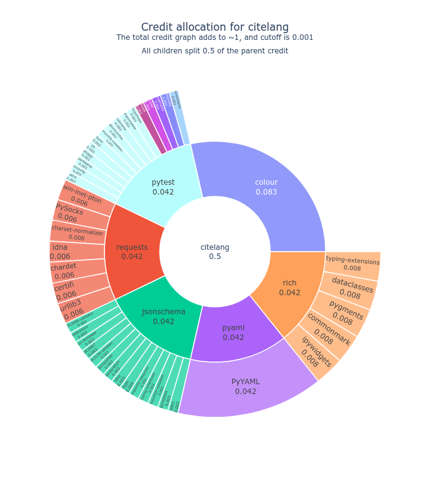

# Summary

Understanding attribution of software is essential for understanding the research software ecosystem
and evaluating the utility or value of any particular library. While substantial work has been done
to discuss research software citation [@10.7717/peerj-cs.86], there is not follow up work to provide
libraries or methods to model this ecosystem for easier study, despite the need [@GLASS2002491; @6886129]. 
CiteLang is the first tool to afford this type of study, offering automated analysis and data extraction for open source
software repositories, generation of summary analysis and graphs for single 
packages or groups of software, and maintaining a local database to store cached data. 
Using CiteLang it is possible to calculate different views of open source contributions for a 
repository [@Sochat1], or to do analyses that describe an entire ecosystem of software [@Sochat2].
This tool should be of interest to research groups interested in studying research software engineering 
[@8816873] or the software ecosystem [@GLASS2002491; @8994167].

## Statement of Need

Research software engineering [@baxter2012research] is becoming a more established profession, providing best practices
for software in research [@8994167] and fueling an entire economy of new jobs for research software engineers (RSEng). 
As this role has grown out of academia, the accepted practice of publication to derive value of an individual has followed tradition
from academia, meaning that RSEng have not only the burden to write software, but to publish papers to prove their value.
While writing a software paper may be appropriate for cases that warrant getting the attention of an academic
community, writing papers should not be the primary way that RSEng are valued. While discussion of research
software citation is not uncommon [@10.7717/peerj-cs.86], what is uncommon is derivation of libraries and 
modeling software that can make it easy to study the ecosystem and propose new paradigms. Work in this area
tends to focus on generating single citations and metadata for a specific project [@codemeta; @cff],
to require manual derivation of details and discussion [@katz_smith_2015], or to make the assumption that 
the end goal or best idea is to still fit research software into the traditional
academic citation system [@force11-github; @citation-implement]. Undeniably, efforts to capture more metadata around a software
project are important, but they typically require extra work on the part of the researcher, and 
do not address the larger question of rethinking valuation of research software engineers. Notably, most
of these papers that discuss software citation provide theoretical examples. There is a gap in work
to provide software to better model the ecosystem, and a community initiative to think about ideas
that go beyond a traditional citation.

### Software for Modeling the Software Ecosystem

CiteLang grew from this need, and is the first library of its kind that aims to empower researchers
to better study the ecosystem by way of providing methods and graph-based modeling of a single project
or larger ecosystem. A research group using Citelang can easily derive:

- How software depends on other software
- How software dependencies change over time
- How the value of a particular software library changes

And can customize an analysis to choose everything from how to distribute credit between software and dependencies,
to setting a minimum credit value to stop parsing, or even to stop parsing after a particular level of dependency is 
traversed. CiteLang works by way of taking advantage of package manager APIs (when available) to automatically
discover software metadata and dependencies, and generates a cache for saving all data and for re-use. 
A list of supported package managers in provided in Table 1.

| Name      | Project Count | Homepage                              | Default Language |
|-----------|---------------|---------------------------------------|----------------- |
| Npm       | 2324490       | https://www.npmjs.com                 | JavaScript       |                         
| Maven     | 469374        | http://maven.org                      | Java             |                         
| Pypi      | 437955        | https://pypi.org/                     | Python           |                         
| Nuget     | 375186        | https://www.nuget.org                 | C#               |                         
| Go        | 365289        | https://pkg.go.dev                    |                  |                         
| Packagist | 355691        | https://packagist.org                 | PHP              |                         
| Rubygems  | 178224        | https://rubygems.org                  | Ruby             |                         
| Cocoapods | 87311         | http://cocoapods.org/                 | Objective-C      |                         
| Cargo     | 81429         | https://crates.io                     | Rust             |                         
| Bower     | 69517         | http://bower.io                       | CSS              |                         
| Cpan      | 39086         | https://metacpan.org                  | Perl             |                         
| Pub       | 30141         | https://pub.dartlang.org              | Dart             |                         
| Clojars   | 24291         | https://clojars.org                   | Clojure          |                         
| Cran      | 22051         | https://cran.r-project.org/           | R                |                         
| Hackage   | 16460         | http://hackage.haskell.org            |                  |                         
| Conda     | 16297         | https://anaconda.org                  |                  |                         
| Meteor    | 13410         | https://atmospherejs.com              | JavaScript       |                         
| Hex       | 12946         | https://hex.pm                        | Elixir           |
| Homebrew  | 7503          | http://brew.sh/                       | C                |                         
| Puppet    | 6923          | https://forge.puppet.com              | Puppet           |                         
| Carthage  | 4515          | https://github.com/Carthage/Cartha... | Swift            |                         
| Swiftpm   | 4207          | https://developer.apple.com/swift/    | Swift            |                         
| Julia     | 3048          | http://pkg.julialang.org/             | Julia            |                         
| Elm       | 2605          | http://package.elm-lang.org/          | Elm              |                         
| Dub       | 2404          | http://code.dlang.org                 | D                |                         
| Racket    | 2193          | http://pkgs.racket-lang.org/          |                  |    
| Nimble    | 1902          | https://github.com/nim-lang/nimble    | Nim              |                         
| Haxelib   | 1703          | https://lib.haxe.org                  | Haxe             |                         
| Purescript| 582           | https://github.com/purescript/psc-... | PureScript       |                         
| Alcatraz  | 464           | http://alcatraz.io                    | Objective-C      |                         
| Inqlude   | 228           | https://inqlude.org/                  | C++              |                         
| Github    |               | https://github.com                    |                  |                         
| Spack     | 6375          | https://spack.github.io/packages      |                  | 

> *Table 1* Package managers supported by CiteLang. A subset use their own APIs, while others use [libraries.io](https://libraries.io). The "GitHub" package manager looks at dependencies parsed from the [GitHub dependency graph](https://docs.github.com/en/code-security/supply-chain-security understanding-your-software-supply-chain/about-the-dependency-graph).

Along with methods to derive data to model the ecosystem, CiteLang provides a suite of command line
tools to generate graphs that can be displayed in the terminal, and other formats
for popular graphing software (dot, Cypher for Neo4j, and Gexf for NetworkX). By default,
CiteLang will use a model that attributes 50% of credit to a main package, and then 50% evenly distributed
to all dependencies, and applied recursively up to a minimum credit limit (e.g., 0.001) or to a specific
level of parsing (e.g., three generations of dependencies). CiteLang also provides a `badge` command for a repository to generate a sunburst badge (Figure 1).

All of these actions can be accomplished from within Python, from the terminal with the CiteLang client, or
via an automated workflow and the GitHub actions [@citelang-actions] that CiteLang provides.
In summary, the software enables research to better understand our research software ecosystem,
and hopefully implement ideas to improve it.

### Community Initiative

A large part of innovation is cultural. On a cultural level, CiteLang is the first tool of its kind to 
suggest an alternative way to value software beyond the traditional academic practice of publication. 
It suggests a model where RSEng are not required to generate separate DOIs (digital object identifiers) 
associated with papers, or supplementary metadata files about the software. This model uses already 
established ways to publish and distribute software, package managers.

CiteLang is part of a larger vision that is needed for an initiative of tooling to empower research groups to study software
and imagine new paradims to supplement or replace citation. Beyond citation, the software offers a set of
tools to enable any kind of graph- or metadata- based study of a software ecosystem. 
If researchers do not have analysis tools that make it easy to model and understand the space, change will come slowly, if at all. 
If research software engineers do not proactively develop and champion tools for this kind of study, it will
be less likely to happen, and we will choose decision through indecision -- valuing research software
engineers based on a broken publication system -- only because it's the way we have always done things,
and nobody has been inspired or empowered to try anything different.

## Conclusion

CiteLang makes it possible to better study the ecosystem of research software. It supports study, visualization,
and data extraction to enable more applied research around software citation.
You can read more about CiteLang at the GitHub repository (https://github.com/vsoch/citelang) or
the [documentation user guide](https://vsoch.github.io/citelang/getting_started/user-guide.html).

# References
